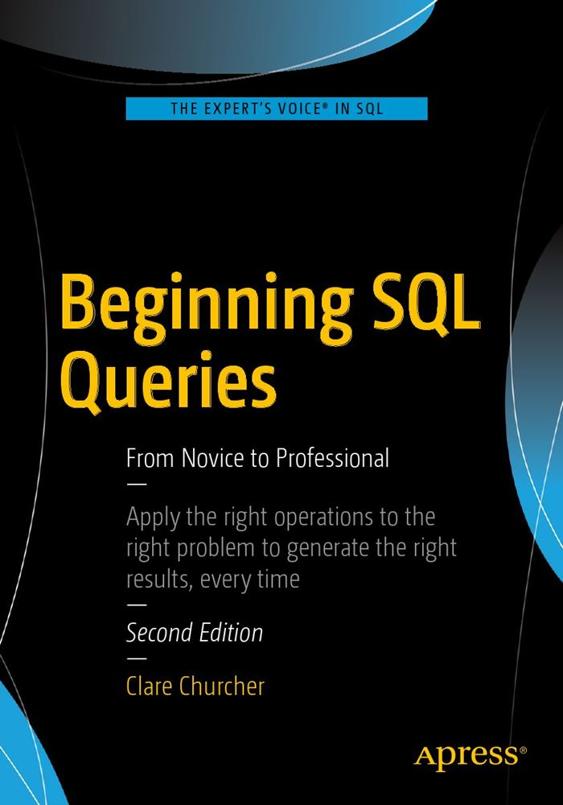

# Beginning SQL Queries-2nd Edition （开始SQL查询：从小工到专家 第二版）中文翻译

# 翻译序言  

第一次知道这本书大概是15年，然后在网上一番搜索之后，竟然没有发现中文本，无奈之下，只能找到了英文原版来看。  
这一看，就是好几年，然后在懒癌+拖延症的双重作用下，一直拖到今天。  
最近因为某些机缘，重新把这书找了出来，然后发现第二版竟然也经出了，于是当时下的第一版也就扔一边去吧……  

简单来说，又是一次英语翻译练习。  
不过这次开的题目有些大，是整本书，而且体量非常庞大，我不知道自己是不是有这个毅力坚持下去。但在没有找到合适的中译本情况下，姑且不自量力地狂妄为之。

不过，鉴于各种主观客观原因，可能到这本书第三版出版了，我还没翻译完，这就别怪我了……

>原书PDF 下载：[http://www.allitebooks.in/beginning-sql-queries-second-edition/)

# 授权声明

虽然本人的这份翻译在各位大神眼中或许就是个渣，但即便如此，也不希望这份翻译被各种盗版商拿去误人子弟，不仅对不起各位学子，也对不起我自己的良心。  
所以本人**保留所有权利**，拿去私用没问题，修改之后自己小范围内分享OK，但就是**不能拿来商用**。  
看了看，似乎就是MIT许可证？

那就暂时这样吧。

# 阅读

## 在线阅读
[开始SQL查询：从小工到专家 第二版 中文翻译](http://beginningsqlqueries2nd.waygc.net/)

## 本地构筑
可以通过 gitbook 构建。

