
# 第一章　关系型数据库总览

SQL（结构化查询语言，Structured Query Language）让我们可以创建表格（table），执行约束（constraint），以及在一个数据库（database）中操纵（manipulate）数据。在本书中我们将聚焦于那些允许我们通过一定的表达去从数据库中获得我们想要得到的信息的查询功能。这些数据可以是像单价一样的简单数字，可以是不再订阅的读者名单，可以是过去12个月的产品销售总额的计算结果。在本书中我们将通过不同的SQL查询方式来获得相同的结果。

在开始查询之前，我们必须要复习一下和关系型数据库相关的术语。我们还会研究种数据模型，这是了解某种数据库是如何通过最简洁的方式将它们组合起来的。也就是数据是如何保存，以及它们之间如何关联的。

这种研究对于准确地了解数据库的底层的设计如何准确表达行为是非常有必要。这不仅仅是说怎么去建立合适的表，也是在说要加上合适的约束，如此一来数据就会保持一致，并且随着数据库的发展保持一致。如果数据库本身的设计有问题，那就算使用了世界上所有的SQL技巧你都无法获得查询的准确的结果。在你开始在项目中着手设计一个新的数据库之前，最好参考一下数据库的设计书[^注0]。

## 介绍数据库的表
简而言之，一个关系型数据库就是一个表[^注1]的集合（set）。所有表所是一张表对应一个实例的良好设计，比如客户、销售额、团队，或者比赛。在书中我们始终会以高尔夫俱乐部为例子对数据库进行说明。所有的表格都会在书中被一一介绍，在附录1中有它们的列表。

### 属性（Attributes）
我们需要在创建表的时候规定这张表所包含的信息。比如成员（Member）表就可能包含名字、地址、联系方式。我们要决定需要哪些信息。比如我们会选择把姓（family name）、名（first name）、首字母（initials）和昵称（preferred name）等信息分开来。这种分离可以让我们更灵活的使用这些数据。比如我们会通过地址联系J.A.Stevens，并在邮件的开头写“亲爱的Jim”。而这些所有被分离出来的部分，就是表的属性。

我们必须先提供一个名称（比如：姓名、差点（Handicap）[^注2]、生日（DateOfBirth））、取值范围（domain）[^注3]或者类型（type）。取值范围是在特定要求范围内的所有数值的集合，可以包含普通值，也可以包含特殊值。比如存储日期的字段的取值范围应该是个合法日期（所以2月29日只能用于闰年），而当字段存储长度时就必须是整数且大于0。我们最初的想法是在姓（FalimlyName）属性的取值范围是任意字符，但在仔细考虑之后我们需要去确认是否要允许某些标点符号（大概率会），如果数字被允许（很难说）那就会要求最大值和最小值。所有的数据库系统都内置了像文本（text）、整数（integer）、日期（data）这些类写供所有字段选用。更复杂的数据库可以允许用户在世在使用交叉表（across table）的时候去自定义数据流类型。比如我们要定义一个叫`CarRegistration`的类型，并规定它的值可以是字母和数字。即便你不能自定义想要的数据类型，所有优秀的数据库都允许设计者在一张表的特定属性上定义约束（constraints）。就像我们会在一张特定的表中定义一个生日属性，可以是到今天为止的日期；或者定义一个差点属性，可以是0到40之间的数字。有些属性可以允许为空，但有些却不允许。

当我们审视表的时候，属性的名字就是字段的名称，取值范围和类型规定了怎么取值。一旦我们完成了表的定义我们就可以按行（row）为单位地添加数据了。比如我们有一张如图1-1所示的`Member`表，每一行都代表了一名会员（member）。

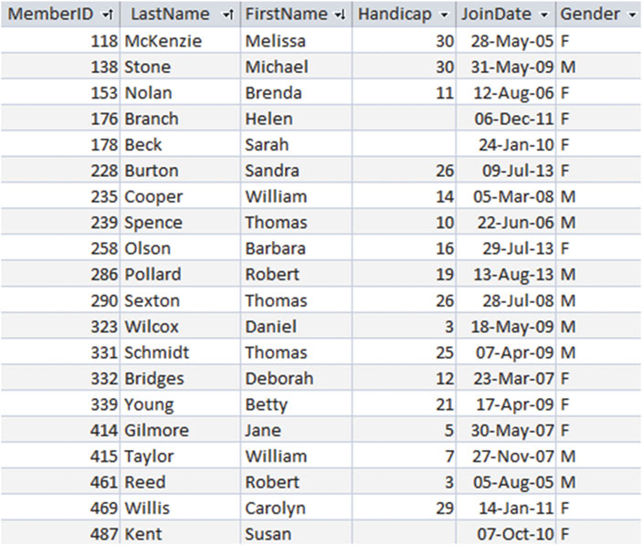  
图1-1 会员表（Member Table）

### 主键（Primary Key）
关系型数据库最重要的一个特点就是表中的每行数据都应该是唯一的。对于每个属性，在同一张表中不能有两条相同的值。再联想到我们的会员数据，就可以搞清楚为什么唯一约束是如此重要了。像图1-1中所示的那样，我们有两条相同的行比如都叫 Brenda Nolan，我们将没有办法区分它们。我们或许会把队伍和其中一个人绑定却将账单绑定到了另一个人身上，从而产生各种各样的混乱。

关系型数据库解决唯一性问题的方法是指定一个主键。主键是一个或者一些属性，这样就能保证，在给定的表中每行数据都可以被区分清楚。在这个例子中的数据中还有其他很多会员，我们无法保证所有会员都有不同的名字或者地址（父子用了同一个名字同一个地址同时加入俱乐部）。这对于在一张表中我们只有足够的属性去区分所有数据来说十分重要。增加一个生日或许就能解决上述问题。如果通过一大堆属性来充当主键则就太笨重了，所以为了帮助区分不同的会员，我们像图1-1中所示的那样在表中引入了一个账号（ID number）属性。我们可以通过制定ID来区分同名的会员。这种方式的一个优势就是哪怕会员的名字变了我们也可以找到这些会员的记录。如果`Member`表中已经定义好了主键`MemberID`，接下来数据库就可以通过`MemberID`来区分每行数据的值。数据库也会明白主键中必需有一个值，那是因为我们不可能添加一个空白的`MemberID`。当有两条数据都使用了同一个`MemberID`（唯一且非空）作为主键的时候，我们总会想办法去将其表示为一条数据。在之后关于表间关系的章节中，我们将会看到这些要求的重要性。

下面的代码是我们在创建如图1-1所示的表时所用到的SQL。所有的属性都被指定了名字和类型。在SQL中`INT`关键字表示了这是一个整数，`CHAR(n)`表示了拥有n个字符的文本序列（string）。代码同样表明`MemberID`是个主键。所有优秀的数据库都会有主键功能。

```
CREATE TABLE Member (
MemberID INT PRIMARY KEY,
LastName CHAR(20),
FirstName CHAR(20),
Handicap INT,
JoinDate DATETIME,
Gender CHAR(1));
```
### 插入（Inserting）或修改（Updating）表中的行数据
本书的重点在于从数据库中取得精准的信息，但是首先要通过某种方式来取得数据。很多数据库程序的开发者提供了对用户非常友好的界面将数据插入到各种表中。一般都会给用户提供一个表单以供为各种表输入数据。图1-2展示了通过 Microsof Access 来为`Member`表录入和维护数据。

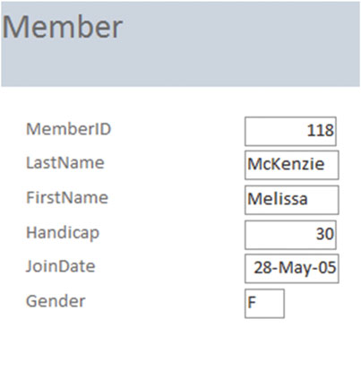  
图1-2 一个`Member`表中允许输入和修改内容的表单

这些表单可能会应用于网络或者机器扫码等方式将数据收集并录入数据库中。数据也可以被一次性的从文件或者其他程序中导入。在所有机械化更新数据的背后是SQL的更新处理。我们来关注一下插入或者更新时所用到的三种类型以及想想它们是像是什么。


下面的代码展示了SQL是怎么把一行完整的数据插入我们的`Member`表中的。所有数据的项目（item）在表被创建之后都必须遵守相同的规则。做个笔记，日期和字符串（string）值必须被包裹在单引号之内。

```
INSERT INTO Member
VALUES (118, 'McKenzie', 'Melissa', '963270', 30, '05/10/1999', 'F')
```

如果有许多数据项目没有输入，我们也可以指定哪些属性有值。如果我们仅仅有ID和姓两个字段的会员信息，我们也可以只插入这两个值，就像下面这样：

```
INSERT INTO Member (MemberID, LastName)
VALUES (258, 'Olson')
```

就像上文所述，当我们要插入新数据的时候必须有主键。

我们也可以在数据被完成记录之后再去修改这些数据。下面的代码就表达了找到ID是118的记录然后修改这条记录的电话号码。

```
UPDATE Member
SET Phone = '875077'
WHERE MemberID = 118
```

上面的代码通过`where`子句（cause）表示了要修改哪些行，以及通过`set`字句来表示哪些字段被修改。

### 设计合适的表
就算是一个非常小的数据库系统也依然会有上百的属性：名字、日期、地址、数量、价格、说明、ID号，以及其他。我们得将他们放到最合适的表中去，总体来说高效和准确就是评价一个表设计的好坏的标准。在有缺点的设计中会出现很多的问题。让我们通过最简单的方式来看看怎么会出错。我临时展示一下和问题相关的多余信息。

假如我们想要给我们的高尔夫俱乐部会员添加队伍（team）和练习日（practice nights）。我们可以就像图1-3所示的那样，在`Member`表中加入两个字段。

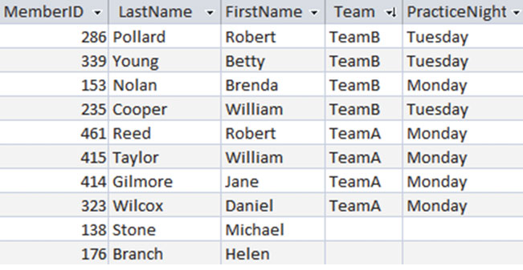  
图1-3 一种会员表

我们马上就可以发现其中的问题：Brenda Nolan 的练习日和她所在队伍其他会员的练习日不一致。所有队伍的训练日都被储存了很多次，所以冲突的发生也就理所当然了。如果我们通过训练日的方式去查找Team B，我们会得到怎么样的结果？应该是星期一，星期二还是两者都要？

这种问题用专业的话来说是表的属性没有标准化（normalized）。标准化是对检查表属性是否正确时非常常用的方式。标准化的内容不再本书探讨的范围内，但我还是要临时说一下怎么去解决这个问题。

这个问题的关键是我们企图将两种不同的信息保存到我们的`Member`表中去。这两种信息包括了会员信息（ID、名字，和其它）以及队伍信息（练习日）。`PracticeNight`（练习日）被放错了表。图1-4展示了通过两张表来解决，一张储存会员信息，另一张储存队伍信息。

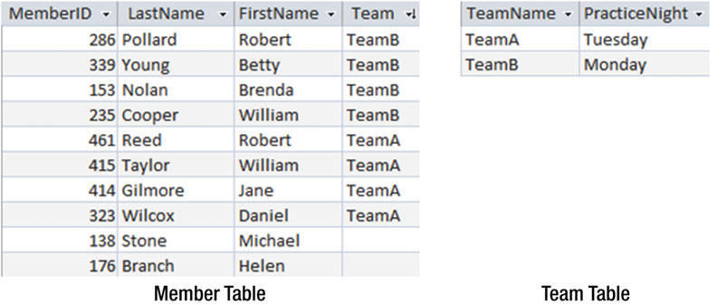  
图1-4 会员表和队伍表

这种隔离措施可以让我们及早的预防住数据的混乱。每个队伍的练习日也都会只储存一次。如果我们要找出Brenda Nolan在那一天练习，我们就要关联（consult）两张表：`Member`表找到她属于哪个队伍，再去`Team`表找到这个队伍的练习日。本书的大部分内容都是关于怎么对数据进行检索和排序的。

### 介绍数据模型
就算是再简单的数据库也会有很多表。数据模型是一种可以表达所有数据是怎么关联在一起的概念模式。我们会使用像UML（统一建模语言，Unified Modeling Language）这样的类图（class diagram nonation）来表达我们的数据模型。在本书中，我们也会采用像Entity Relationship Diagrams（ER图）这样的的其他很多方式来表达数据结构。我们选择UML是因为它拥有非常庞大的视图开发工具，不仅仅可以表达数据结构也可以表达数据的行为。在这里我们会说明一个类图会如何变成关系型数据库中的表和约束的。

类（class）是一种东西所包含的东西（像人、地方）的抽象概念。举例来说，我们会希望高尔夫俱乐部的会有都能有名字以及其他详细信息。图1-5展示了怎么用UML来表达出`Member`类。类的名字显示在顶部区域，下部区域则显示了所有的属性。类图也可以有其他的区域去显示与类的行为有关的方法。

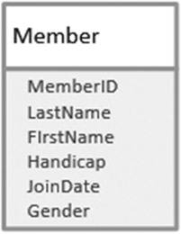  
图1-5 用UML表示的会员类

在关系型数据库中，任何一个类都可以被视为一张表，属性就是字段，属性的实例（这里就比如俱乐部的每个会员）就是表中的行。

数据模型也可以描述不同的类是怎么关联在一起的。图1-6就显示了`Member`和`Team`两个类之间的关系。

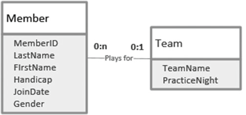  
图1-6 两个类之间的关系

图1-6中的“Plays for”连接线两端的数量对表示了有多少会员从属于一个队伍，反过来就表示了一个人可以属于多少队伍。数量对左边的数字标号il该数量对可以拥有的最小数字。这通常是0或1可以被选择（表示一个会员必须关联一个队伍，或者相反）。第二个数字被称为基数，表示关联对象最多可以有多少，它通常是1或者多，尽管其他数字也有可以，但一般都写成n或*。

关系可以从两个方向来理解。如果是从左向右去理解图1-6中的关系，我们需要找到一个合适的动词来形容两个方向。我们称之为“队伍**拥有**会员”。从左向右理解图1-6我们会看到任意一个会员可以不加入任何一个队伍也可以最多加入一个队伍（数字0和1在连接线接近`Team`类的那端）。如果从右向左理解，我们可以说每一个队伍可以没有任何会员，也可以拥有很多会员（数字0和n在连接线接近`Member`类的那端）。像图1-6中所展示的这种关系被称为1对多关系（一个会员仅能加入一个队伍，一个队伍可以拥有多个会员）。

你或许认为一个队伍应该恰好有四人以符合比赛规则。这种想法在当我们的队伍一直是高尔夫球队时则没有任何问题，但我们的数据库为了让队伍始终可以添加和删除会员而保留了不同的数字。数据模型使用0、1、n去构筑两张表之间的关系。其他的约束（像队伍拥有会员的最大值）更多的时候需要通过UML结合具体的规则才能表达[^注4]。

我们可以在数据库中通过主键表达1对多关系，并将相同类型的字段添加到多那一侧的表中。像图1-6那样的模型我们以添加一个`Team`字段到`Member`表中，就像图1-7所示的那样。

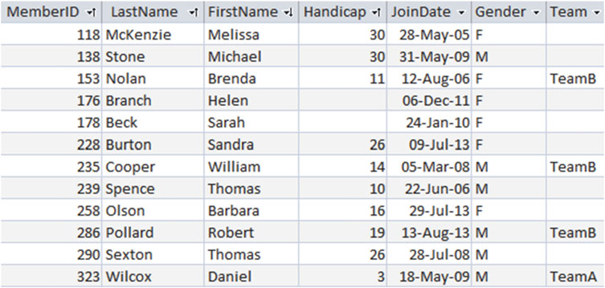  
图1-7 一张`Team`字段含有外键（foreign key）的`Member`表

`Team`字段被称为外键。`Table`表中`Team`字段的任何非空值都必须作为主键存在于`Team`表中。这个外键的意思就是我们不能将`Member`表中的会员指定给一个`Team`表中不存在的队伍。这种约束被称为引用完整性（referential integrity）[^注5]。

通过下面的SQL可以创建一张带有外键的表：

```
CREATE TABLE Member(
MemberID INT PRIMARY KEY,
LastName CHAR(20),
FirstName CHAR(20),
Phone CHAR(20),
Handicap INT,
JoinDate DATETIME,
Gender CHAR(1),
Team CHAR(20) FOREIGN KEY REFERENCES Team);
```

因为我们需要对`Member`表中的外键和`Team`表中主键进行比较，所以这两个字段必须拥有相同的取值范围或者数据类型。

很多数据库产品都提供了可以设置外键约束的图形界面。图1-8展示了Microsoft© SQL Server[^注7] 和 Access 的界面。这些图形就是数据模型的图形化显示，所以我们知道怎么获得我想要数据，也方便我们去理解数据结构，

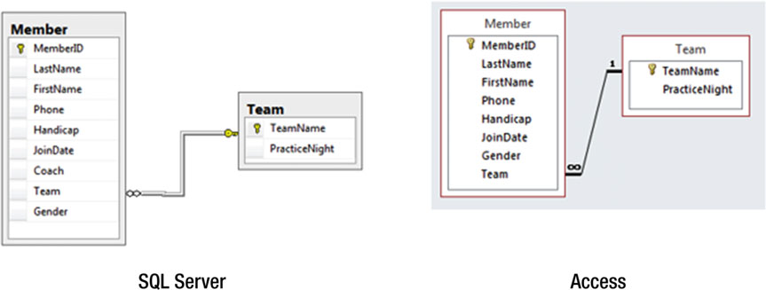  
图1-8 使用外键表示的1对多关系图例

图1-4 和 图1-7 中的两张表其实是一种设计。在图1-4中，我删除了`Member`表中的`PracticeNight`字段，然后创建了一个新的`Team`表（标准化的过程）。在图1-7中，我们首先确认了数据模型，然后在`Member`表中增加了`Team`字段让我们可以将`Member`和`Team`关联起来。不管哪种方式，结果都是一样的。

虽然有些啰嗦，我还是要在说一下保证数据库有着良好设计的重要性。哪怕只有少量数据图1-6中的简单模型也肯定是不合适的。一个真正的俱乐部会记录会员在很多年之间的情况变化。这就包括了每年或者每赛季队伍中的会员信息。某些替补会员可在一年中属于多个队伍。这些信息或许有必要保留也或许没有。设计一个有效的数据库是一个麻烦的活，也超出了本书的范围[^注6]。

## 从数据库中检索信息

现在我们有了一些标准化的表组织在一起的良好设计的数据库，我们可以开始去尝试着将数据取出来了。当我说“取出数据”之类的话时并不意味着我们要删除任何数据。可以把查询（query）想像成数据库对外开放一个非常小的窗口。很多数据库系统都有图形化界面可供简单查询所用。图1-9展示了 Access 数据库从`Member`表中抽取高级会员时用到的界面。复选框表示我们要查哪些字段，而`Criteria`表示我们得到的数据该符合哪些条件。

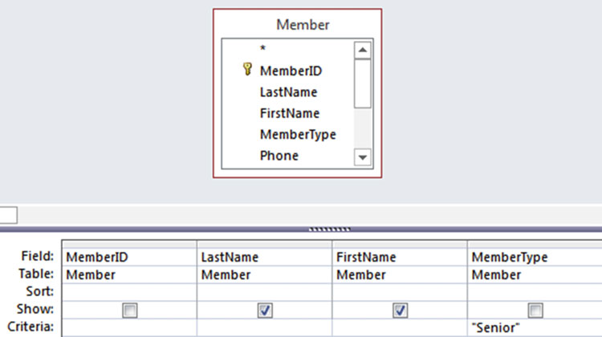  
图1-9 在`Member`表上进行简单查询时的界面

数据库程序会从图形界面中获得相关信息并构建成SQL查询语句。大多数数据库程序都会显示自动生成的SQL，并且你也可以自己去修改或者编写SQL。图1-9的条件转换成SQL则如下：

```
SELECT FirstName, LastName
FROM Member
WHERE MemberType = 'Senior';
```

这句SQL包含了三个子句：SELECT字句表示你想要抽取出哪些字段，FROM表示你想从哪些表中抽取数据，WHERE字句表示你想要抽取的数据所必须要符合的条件。查询所要的表达的目的已经说明白了，之后我们会更详细的解释SQL的语法结构。

因为我们要通过各种各样的样式去关联越来越多的表，图形界面就会显得越来越力不从心，然后我们通常就需要直接去编写SQL。一般来说通过抽象的方式来思考查询会更容易理解。对想要的东西进行抽象化整理后，这些内容就会更容易的写成恰当的SQL语句。这是在关系型数据库中的两种不同的查询方法。

### 过程方法
查询是一种我们去操纵表的方式。让我们想想我们应该怎么去获得练习日在星期一的会员名字。我们首先想到的是从`Team`的`PracticeNight`字段的值是星期一的行。我们将这些行关联（之后再介绍连结(join)操作）到`Member`表，然后从关联之后的结果集中取出姓名。因为这些操作是一系列的顺序步骤，所以我们将其称之为过程方法。图1-10描绘了这些步骤。

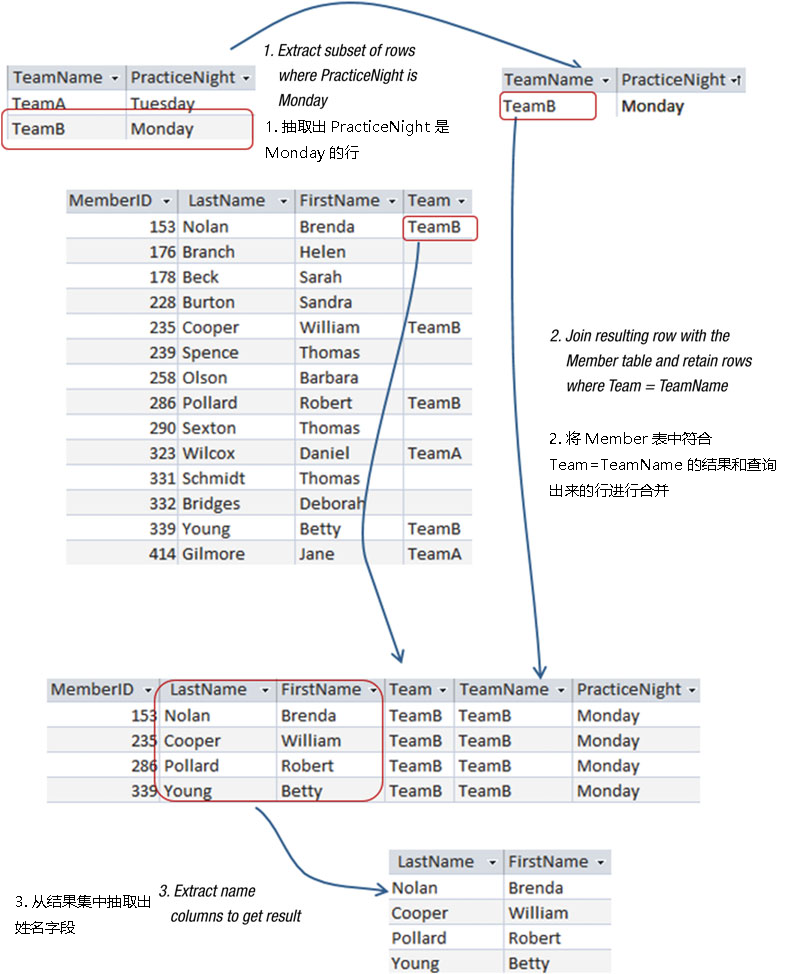  
图1-10 过程方法：把查询想像成一个操作序列

### 结果方法（Outcome Approach）
另一种的思考方式是从`Member`表中找到所在的队伍的练习日是星期一的那些会员。图1-11就是这种思考的图示。行`m`是我们要从`Member`找到符合队伍训练日条件的行，所以我从这一行中抽取姓名。

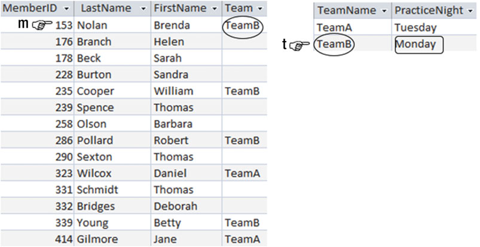  
图1-11 看看行m是不是满足查询的要求

因为我们想的是要得到什么而不是怎么去得到，所以把这种关于查询的思考模式之为结果方法。

### 为什么我们要用两种方法
关系型数据库的理论来源于集合论。如果我们把表想像成行的集合，查询就变成了操作所有的集合找到一个符合我们要求的子集。关系理论有两种常规思路去从子集中提取数据：关系代数和关系演算。

我们不需要将这些抽象的理论应用于简单查询。但如果整本书都很简单，您也不会继续往下读了。在第一个例子中，查询可以通过任何语言表达而不会引起歧义。试着简单描述一下：“帮我找到所有学生中要么年龄在20岁以下要么住在家里还同时还有补贴的学生。[^注8]”这里的歧义来源你在哪里插入逗号。如果把逗号插在“20岁以下”之后就表示所有20岁以下的人都必须被筛选出来，而如果逗号在“住在家里”的后面则表示还需要所有被筛选的对象都拿到补贴。甚至于在我们通过自然语言弄明白要求之后，我们才能通过数据库中表的真实情况来考虑怎么去查询。这就表示在写查询的时候意思得非常准确。关系代数和关系演算给了我们打成准确和高效的办法。

为什么不直接跳过这些抽象的东西而去学SQL呢？因为SQL语言中包含了关系代数和关系演算。早一点的SQL版本完全基于关系演算，因为SQL表达的是**想要什么**更胜于**怎么去做**。现在的SQL实现已经允许你在表上使用像连连结（`join`）、联合（`union`）和交叉`intersections`这样的代数运算符号。

一般都会有一些不同写法SQL可以表达同一个意思。有些时候我们非常依赖关系演算，有些时候又会依赖关系代数，或者两者同时使用。我在大学担任讲师的时候我经常问班上的学生：对于某个特定的问题，关系演算和关系代数那种更容易理解。回答基本都是五五分。就我自己而言，我发现某些查询特别适用关系代数，而更多见到那查询却适用于关系演算。一旦我把想法给明确之后，再去写SQL（或者其他的查询语言）就很明白了。

我们利用的是关系函数和关系演算的思想而不是去研究数学。我在本书中将用过程方法（关系代数）和结果方法（关系演算）来替代。你会使用越多的工具，就越可能准确的表达出你想要的复杂查询。如果你有兴趣，附录2中有一篇关于关系代数和关系演算的符号的介绍。

## 小结

## 译注
[^注0]: 原书注：For example, you can refer to my other Apress book, Beginning Database Design: From Novice to Professional (New York: Apress, 2012).

[^注1]: 原书注：More correctly, it’s a set of relations. In the body of the book common words such as table and row are used. In Appendix 2 we introduce the more formal vocabulary and notation.<br>中文翻译：更正确的说法是，这是关系的集合。在书的正文中经常会用到表和行等词。在附录2中，我们将介绍更正式的说法和符号。

[^注2]: 这里的原词 “Handicap” ，查了一下应该是说高尔夫球中的某种计分方式。参阅资料：https://baike.baidu.com/item/handicap/8441761

[^注3]: domain的意思有些像在说取值范围，所以这个词暂时直接用翻译为取值范围

[^注4]: 原书注：Alistair Cockburn, Writing Effective Use Cases (Boston, MA: Addison Wesley, 2001).

[^注5]: 引用完整性引用完整性同为，参照完整性（Referential Integrity）引用完整性指被引用表中的主关键字和引用表中的外部主关键字之间的关系。如被引用行是否可以被删除等。 参阅资料：[https://baike.baidu.com/item/引用完整性/1236599](https://baike.baidu.com/item/%E5%BC%95%E7%94%A8%E5%AE%8C%E6%95%B4%E6%80%A7/1236599)

[^注6]: 原书注：For more information about database design, refer to my other Apress book, Beginning Database Design: From Novice to Professional (New York: Apress, 2012).

[^注7]: 之后的行文中只要不出现歧义，第二次出现的公司名都将省略

[^注8]: 原文：Find me all students who are younger than 20 or live at home and get an allowance.