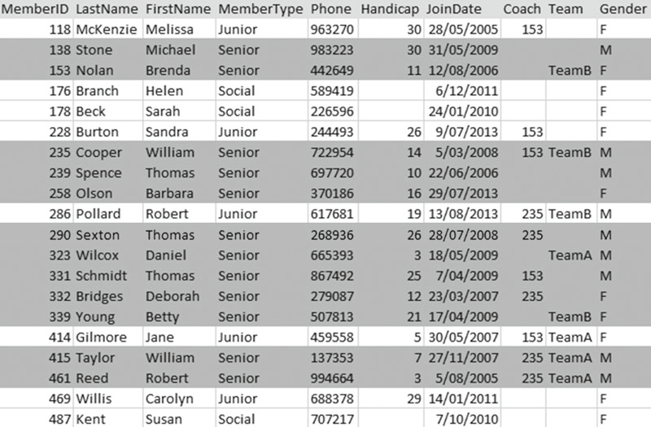
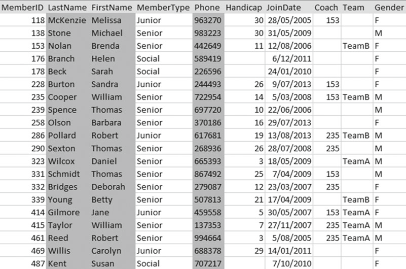
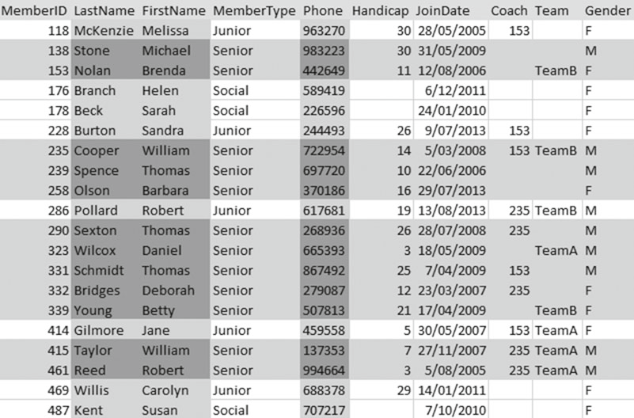
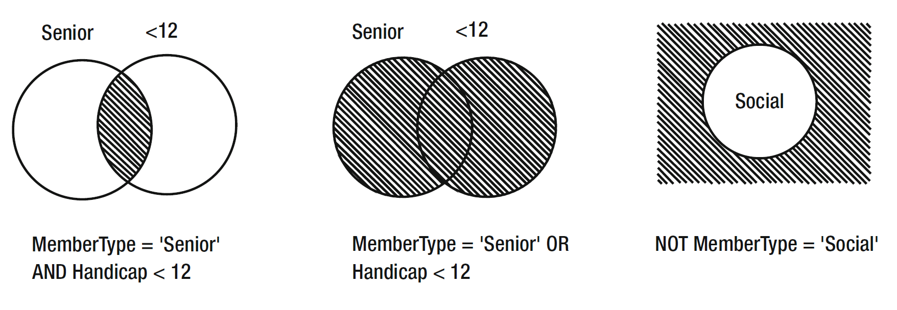
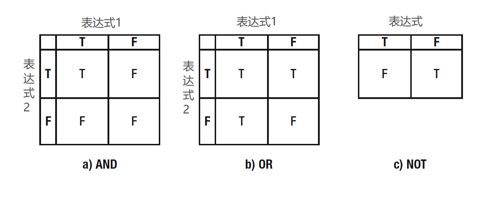
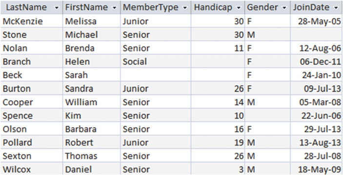

# 第二章　在一张表上的简单查询

如果一个数据库有着良好的设计，数据都应该保存在不同的表中。正如我们的高尔夫数据库就把会员、队伍、比赛分别保存在了不同的表中，并将它们的数据都关联在了一起。比如哪些会员加入了哪些队伍，参加过哪些比赛，以及其它。为了以最好的方式利用我们的数据，我们需要在不同的表中检查数据确认哪些是我们所要的。

在本章中，我们将会关注从单表中获取数据。这可能是数据库中的一张永久表（permanent table），也可能是用以临时储存复杂查询结果集的一部分的虚拟表（virtual table）。

我对“检索”和“返回”的讲述一直都不太准确。查询出结果对行来说发生了什么？事实上，我们并没有从表中删除数据或者将其放在哪里。查询就像是数据库对外的一个窗口，通过这个窗口可以看到我们想要的信息。如果数据库底层的数据有了改变，查询出的结果也会改变。只要你能理解这只是临时的，就并不难理解查询将“搜索”到的数据存放在“虚拟表”中。

## 行和列（字段）[^注0]的子集

在查询的时候选择行或者列的子集是一个非常惯用的手法。下文我们将关注从数据库的一张表中选择一些行和列[^注1]。通过其他方式从虚拟表中获得数据的方式也一样有效。

在决定要从表里面获取哪一行之前，必须要通过一个是否判断语句来表示检索条件。我们把条件作用在独立的表的每一行上，保留判断为真的条件并舍弃其它。所以当我们说要去找高尔夫俱乐部中的所有高级会员（senior member）时，我们仅仅需要的是 `Member` 表中 `MemberType` 字段的值是“Senior”的那些行的子集，就像 图2-1 所示。

>   
> 图2-1 获取高级会员的行的子集

查找高级会员的 SQL 语句就像下面这样：

```
SELECT *
FROM Member
WHERE MemberType = 'Senior'
```

这条 SQL 有三个部分，或者说子句：`SELECT` 子句告诉了我们要找哪些字段。在这个例子中`*`的意思是查找所有的字段。`FROM` 子句告诉我们需要去查找那张（些）表，还有 `WHERE` 子句决定了只有符合特定条件的行会被选中到结果中。这里的条件是要检查 `MembetType` 域中的值。在 SQL 中，当我们给一个文本字段或者字符字段，我们需要给值的两边包裹上单引号，就像`'Senior'` 这样。

现在让我们看看数据库是怎么从表中找到那些我们想要的某些列的。通常我指的是选择出行的子集以及映射（project）出列的子集。映射一个列的子集通常是一系列操作的最后一步。我们可以这样认为：先把我们要的所有数据都收集起来，然后最后再去检出哪些我们想要的属性或者字段。我们将会在第七章中看到有些时候我们也会在引用某些集合操作前从原始（original）或者虚拟（ virtual ）表中中去映射相似的字段，比如 union 和 intersect 。

如果我们仅仅想要一个所有会员电话号码的列表，而不要其他诸如差点和加入日期的信息。图2-2 展示了 `Member` 表的 `mane` 和 `phone number` 字段的子集。

>   
> 图2-2 映射必须要有电耗号码列的子集

从 `Member` 表中查找名字和电话号码的字段的 SQL 是这样的：

```
SELECT LastName, FirstName, Phone
FROM Member
```

因为我们要看到所有行的些字段的值，所以这次查询没有 `WHERE` 子句。

把行和列的检索结果组合成一个子集是一个非常简单的事情。如果我们仅仅想要得到高级会员的的电话列表，就像 图2-3 那样。

>   
> 图2-3 查找出的高级会员的电话列表的行和列子集

图2-3 中的 SQL 是这么写的：

```
SELECT LastName, FirstName, Phone
FROM Member
WHERE MemberType = 'Senior'
```

## 使用别名（alias）

当我们将不同的表组合在一起时候，我们的查询会变得越来越复杂。有些表或许会有一些同名的字段，这时候我们就需要去区分它们。在 SQL 中我们可以在查询中每个属性前面加上表名来表示这个字段来自哪张表。就像这样：

```
SELECT Member.LastName, Member.FirstName, Member.Phone
FROM Member
WHERE Member.MemberType = 'Senior'
```

因为输入完整的表名会比较麻烦，另外我们也在一些查询中去比较来自一张表的许多行的数据，所以 SQL 有了一个别名的概念。我们看一下下面这个查询：

```
SELECT m.LastName, m.FirstName, m.Phone
FROM Member m
WHERE m.MemberType = 'Senior'
```

在这里的 `FROM` 子句中，我们给 `Member` 表起了一个叫 `m` 的别名或者叫替代名。我们可以给别名起任何我们喜欢的名字，只要简单就好。然后在查询剩下的部分中我们可以使用这个别名去定位`Member` 里的任意属性。给每张表都起一个别名是一个好习惯。

## 保存查询

有些时候会需要将查询的结果放在一张新的永久表中（有些时候也叫它快照（snapshot）），因为一旦底层数据有所改变，这些快照就会过时，所以我们通常并不希望这么去做。我们最想要的是保存查询指令（query instructions），以便于我们可以在其他时候执行相同的命令。想一想我们的电话表查询，在俱乐部的会员列表更新后，我们都会重新生成电话表。而不是每次都要重新写查询，我们可以把储存起来的指令称为视图（view）。下面的代码展示了怎么去创建一个视图，我们可以通过这个视图来获得最新的电话表。我们必须要给这个视图起一个任意我们喜欢的名字（PhoneList 看起来不错），然后绑定 SQL 语句就可以得到我们想要的数据了。

```
CREATE VIEW PhoneList AS
SELECT m.LastName, m.FirstName, m.Phone
FROM Member m
```

你可以认为 `PhoneList` 是通过指令创建的一张“虚拟”表，所以我们在用其他真实的表进行查询的时候也用同样的方式来处理。我们只要知道虚拟表是在永久的 `Member` 表上执行查询语句动态创建的就可以了。这下我们就可以通过 `PhoneList` 视图非常简单地获得电话表了。

```
SELECT * FROM PhoneList
```

## 指定筛选行的条件

在前面章节的查询中我们可以看到，我们需要使用通过的条件或者标准来决定哪些行可以被筛选到查询的结果中。在下面的章节中，我们会看到更细致地研究通过不同方法来实现指定的复杂条件。

### 比较运算符（Comparison Operators）

提交是一个值为真或假的语句或者表达式，就像 `MemberType = 'Senior'` 。这种类型的表达式被称为布尔表达式[^注2]，以研究了布尔表达式的19世纪英国数学家乔治·布尔命名。这些条件是我们用来从表中筛选数据的，常常需要去将一个属性的值和某些常量（constant）或者另一个属性去比较。比如我们可以要求属性的值是否相等、不等、或者大于其他值。表2-1 展示了一些我们会在查询中用到的比较运算符。

表2-1 比较运算符

| 运算符 | 释义 | 示例 |
| --- | --- | --- |
| = | 等于 | 5=5 , 'Junior' = 'Junior' |
| < | 小于 | 4<5 , 'Ann' < 'Zebedee' |
| <= | 小于等于 | 4<=5 , 5<=5 |
| > | 大于 | 5>4 , 'Zebedee' > 'Ann' |
| >= | 大于等于 | 5>=4 , 5>=5 |
| <> | 不等于 | 5<>4 , 'Junior' <> 'Senior' |

只是一个简短的提醒：**在 表2-1 的例子中我们示意了数字和一些字符（character）的比较**。我们重新去看第一章创建一张表，我们为每个字段都指定了一个类型，比如 `MemberID` 被指定为 `INT` (整数)，还有 `LastName` 是 `CHAR(20)` （20个字符的空间）。对于整数这样的字段，可以直接比较值。比较文本（text）或者字符字段，则通过字母顺序来比较，还有日期和时间字段则会按时间顺序（哪个时间更早）来比较。

当我们比较字符的时候，会基于 ASCII[^注3] 或者 Unicode[^注4] 的值来进行。就像“A”（ASCII码值65）早于“Z”（ASCII码值90），所以“A”<“Z”。如果是一个字符串，当第一个相等的时候会按顺序接着比较第二个、第三个，直到最后。所以“ANNABEL”<“ANNE”。同时，小写字母也比大写字母拥有更靠后的排序，就像“a”（ASCII码值97）>“Z”（ASCII码值90）。如果按默认的照字母顺序去排序的话，有小写字母的字符串会比有大写字母的单词出现的更晚。比如“van
Dyke””会在“Zebedee”之后才出现。

如果我们把数字也当作文字，他们也会遵守字母顺序。这就表示你会得到类似“400”<“5”这样的结果。因为左侧的第一个字符“4”（ASCII码值34）“4”（ASCII码值34）小于右侧的第一个字符“5”（ASCII码值35）。所以一定要弄清楚包含了数字的字段是按照数字顺序来进行比较和排序的，以及这个字段确实是数字类型，不然你只会从查询的中得到一些意想不到的结果。同理，日期字段必须使用日期格式，不然比较和排序的结果可能就不是您所想要的了。

通过比较运算符，我们可以进行更多不同的查询。表2-2 列出了一些我们能将其作用于 SQL语句的 WHERE子句 中的布尔（boolean）表达式，以便 SQL语句 可以从 `Member` 表中查找想要找的行。

表 2-2 `Member`表 布尔表达式的例子

| 表达式 | 得到的行 |
| --- | --- |
| MemberType = 'Junior' | 所有初级（Junior）会员 |
| Handicap <= 12 | 所有差点小于等于12的会员 |
| JoinDate >= '01/01/2008' | 所有在2008年及以后才加入的会员 |
| Gender = 'F' | 所有女性会员 |

有些 SQL 在查询的时候区分大小写，而有些不是。区分大小写也就认为大写字母和小写字母是不一样的。换句话说，“Junior”和“junior”不一样，和“JUNIOR”也都不一样。我经常要随机检查我们的新数据库系统看看它们做了什么。如果你不注意正在输入的内容的大小写（比如，您对在 `MemberType` 中用“Junior”或者“jUnIoR”或者别的方式的检索结果没什么意见[^注5]）你可以使用 SQL 中的 UPPER 函数。这个函数会在进行比较之前把所有的目标文本都转换成大写字母[^注6]。你就可以让它和大写字母进行对比，就像下面的代码：

```
SELECT *
FROM Member m
WHERE UPPER(m.MemberType) = 'JUNIOR'
```

### 逻辑运算符（Logical Operators）

我们可以把多个布尔表示联合在一起，去创造更有趣的条件。比如，我们可以指定两个表达式在检索特定的行的时候都必须为真（true）。

假设我们要找到所有初级女性会员。这就需要让两个条件为真：必须是女性且必须是初级会员。我们可以很容易地将这两个条件独立表达出来。在这之后我们通过一个 `AND` 逻辑运算符去将降格条件联合起来：

```
SELECT *
FROM Member m
WHERE m.MemberType = 'Junior' AND m.Gender = 'F'
```

我们将会学习三个逻辑运算符：`AND`（与）、`OR`（或）以及 `NOT`（非）。我们已经知道了 `AND` 是如何工作的了。如果我们在两个表达式之间使用 `OR` ,就表示只要一个表示为真就可以了（如果两个同时为真也没关系）。`NOT` 作用于一个表达式。比如要从我们的 `Member` 表中指定条件 `NOT (MemberType = 'Social')`。这表示检查所有行，并找到 `MemberType` 的值是“Social”的行，然后舍弃这些行。表2-3 给出了更多使用逻辑表达式的例子。

表2-3 逻辑表达式示例
| 表达式 | 释义 |
| --- | --- |
| MemberType = 'Senior' AND Handicap < 12 | 高级会员，且差点小于12 |
| MemberType = 'Senior' OR Handicap < 12 | 高级会员，或者差点小于12 |
| NOT(MemberType = 'Social') | 除了特别会员[^注7]外的所有会员（当前的数据中只有高级会员和初级会员） |

图2-4 是 表2-3 查询结果的示意图。每个圆都代表了一字段的集合（就像是特别会员或者差点低于12的会员）。阴影部分则是逻辑运算的结果。


>   
> 图2-4 逻辑运算的示意图

图2-5 的真值表[^注8]可以帮助我们去理解逻辑运算符是怎么工作的。你需要先这样看他们：在图2-5a 和 2-5b 中，我们有两个表达式，一个横在上边，一个竖在左边。每个表达式都有两个值：真（T）或假（F）。如果我们将它们通过“与(AND)”表达式来组合，那 图2-5a 表示只有当所有表达式都为真时结果才为真（表格的左上角）。如果我们将它们通过“或（OR）”表达式来组合，那在所有结果中只有全部是假最终结果才是假（图2-5b的右下角）。图2-5c中的表说明如果原始结果是真，，而我们在其之前放置了非（NOT），那结果也是假（左边的列），反之亦然[^注9]。

>   
> 图2-5 逻辑运算的真值表（T=真，F=假）

有些时候将自然语言翻译为布尔表达式会有些困难。如果你被要求提供一份包括所欲偶女性会员**和**初级会员的列表（别问为什么！），你或许会将上述文字翻译成这样的组合 `MemberType = 'Junior' AND Gender = 'F'`。可惜 `AND` 表示两个提交都要满足，所以结果只会给出初级女性会员。而我们的自然真正想要的意思是“我想要一个是女性会员或者初级会员（或者两个都是）的结果”。小心再小心。

## 处理 `NULL`

之前在 图2-1 所示里的`Member`表 里的数据都是准确完整的。每一行的所有属性都有一个所对应的值，但也并非都是如此，就像 `Handicap` 。真实的数据一般并不会这么干净整齐。让我们关注 图2-6 里所示的另一份数据。

>   
> 图2-6 包含缺失数据的表

如果表格中的单元格中并没有数据，我们把这个状态称为 `null`（空） 。null 是数据库经常会让人头疼的东西。思考一下这么两条执行：一条去列出所有男性会员，另一条列出所有女性会员。要知道所有高尔夫选手需要表明自己的性别才能参赛，所以我们俱乐部所有的会员都应该会被列在两张表格的一张中。但是从 图2-6 的数据中我们会看到，我们会丢失 Kim Spence 这名会员。你也许会说不应该让数据变成那样，但我们在讨论的是缺少了准确和完整的数据的真实会员和俱乐部之间的关系。或许 Kim 忘记（或者拒绝）登记性别信息。我们可以通过在创建表的时候不允许出现 `null` 来规避这个问题。下面的 SQL 就像我们展示了如果让 `Gender` 字段必须有一个值：

```
CREATE TABLE Member (
MemberID INT PRIMARY KEY,
.....
Gender CHAR(1) NOT NULL,
....)
```

需要注意的是，为字段添加非空（NOT NULL）可能会比因为`NULL` 而导致更多的问题。虽然 Kim Spence 没有完整地填写申请表上的所有内容，但实际上已经支付了会员款，那我们就会先将其记录为会员，之后才会去考虑将信息完整化。如果我们将 `Gender` 设置为必填字段，那我们就无法创建数据——除非我们去猜测会员的性别是什么。这两种方法都不是最好的选择，所以我们最好允许在创建字段的使用可以留空。要知道我们的主键（根据定义[^注10]）总是会有值的。

并不说所有数据只要有 `NULL` 就是有问题的。在我们的 `Member`表 中，一个字段没有值仅仅是因为它并没有指定给某个会员。Helen 和 Sarah 的差点可能真的是 0 ，因为她们都没有参加过比赛[^注11]。但所有成员的 `MemberType` 和 `JointDate` 都被要求有一个值，所以这些字段中的 `null` 值是因为我们不知道这些值是什么。事实上，您无法保证您的表不会丢失数据。

### 找到 `NULL`


## 译注

[^注0]: 因为列和字段对应的单词都是 column ，所以今后如果不造成歧义，将不再刻意区分，看到哪个合适就用哪个。

[^注1]: 原书注：In the formal terms of relational algebra, retrieving a subset of rows (tuples) from a table (relation) is known as the select operation and retrieving a subset of attributes (columns) is known as the project operation. See Appendix 2 for more information.<br>中文翻译：关系代数的正规描述中，从一个表（关系）中获取行（元组（tuples））的子集叫做选择（select）操作，而获取属性（字段）的子集叫做映射（project）操作。详情见 附录2 。

[^注2]: 布尔表达式只有两个值：真和假，本节中所有的“逻辑表达式”一词都是指代“布尔表达式”，其他具体的说明参看本节内容。

[^注3]: ASCII ((American Standard Code for Information Interchange): 美国信息交换标准代码）是基于拉丁字母的一套电脑编码系统，主要用于显示现代英语和其他西欧语言。它是最通用的信息交换标准，并等同于国际标准 ISO/IEC646。ASCII 第一次以规范标准的类型发表是在 1967年 ，最后一次更新则是在 1986年 ，到目前为止共定义了 128 个字符。<br />参考网站：http://www.asciitable.com/ 。

[^注4]: Unicode（统一码、万国码、单一码）是计算机科学领域里的一项业界标准，包括字符集、编码方案等。Unicode 是为了解决传统的字符编码方案的局限而产生的，它为每种语言中的每个字符设定了统一并且唯一的二进制编码，以满足跨语言、跨平台进行文本转换、处理的要求。1990年 开始研发，1994年 正式公布。

[^注5]: 这里的原文是：“that is, you are **happy** to retrieve rows where MemberType is “Junior” or “jUnIoR” or whatever”，我有些不太理解其中“happy”的意思，所以姑且按现在这么来翻译。但这里总感觉上下文的逻辑有些奇怪，留着以后再改。

[^注6]: UPPER函数 为每个文本单独进行处理，并当所处理的文本不在 a-z 的范围内时，该函数不做任何处理。

[^注7]: 这里的原文是“social”，social 一词，因为不知道具体情况不好翻译，所以姑且翻译成为“特别会员”。

[^注8]: 真值表是表征逻辑事件输入和输出之间全部可能状态的表格。列出命题公式真假值的表。通常以T(true)表示真，F（false）表示假。命题公式的取值由组成命题公式的命题变元的取值和命题联结词决定，命题联结词的真值表给出了真假值的算法。<br />参考地址：https://baike.baidu.com/item/%E7%9C%9F%E5%80%BC%E8%A1%A8 。

[^注9]: 这里的意思是，一个逻辑表达式为真的情况下，取其“非”值，就是“非真”。而因为布尔表达式只有真和假两个值，所以非真=假。<br />反之，如果一个逻辑表达式为假，其非值就是非假=真。

[^注10]: 主流数据库都应该禁止主键为空，也就是默认主键都是 NOT NULL 的状态。

[^注11]: 因为不明白差点是怎么获得的，所以将原文中的“do not have handicap” 翻译成“都没有参加过比赛”。