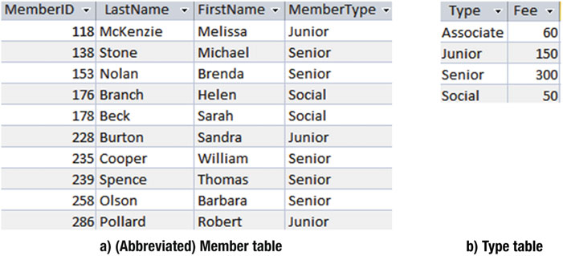
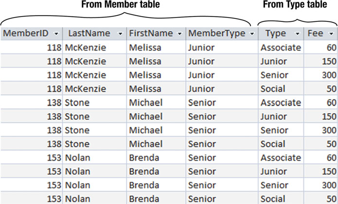
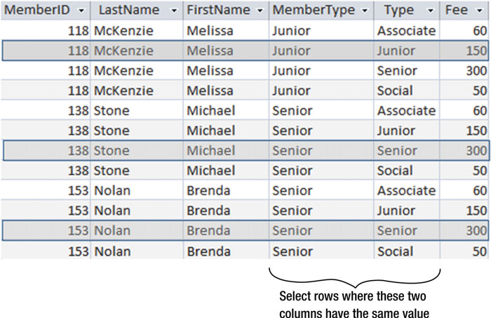
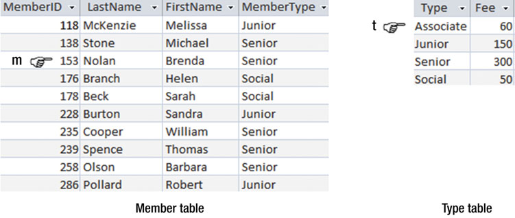
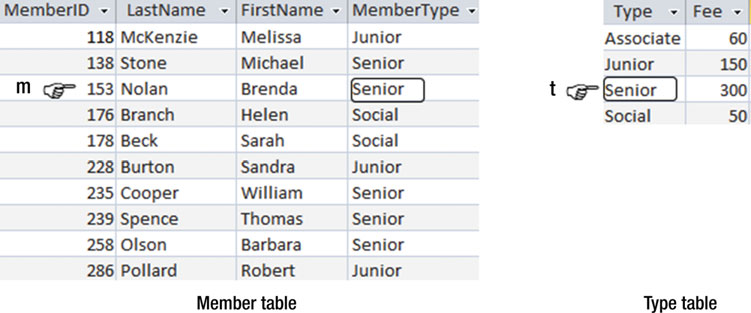
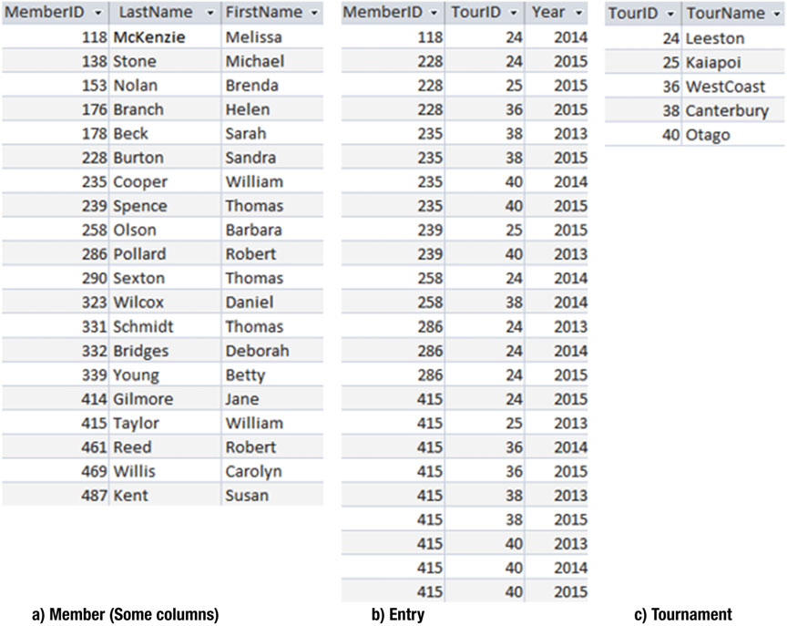
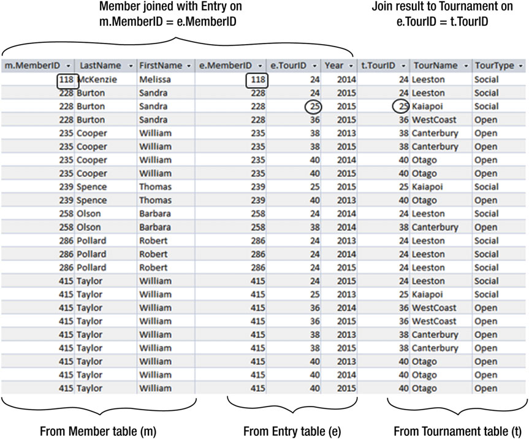

# 第三章　从连接（JOIN）开始

通过前面的章节，我们学习了怎么从单表中查找行或列的子集。第1章 中，我们学到了怎么把数据准确的存入数据库，信息的不同切片（aspect）都要存到对应的规范化的表中。很多查询都要从两张甚至更多的表去引用信息。我们可以用多种方式把两张表里的数据的属性组合成我们想要得到的样子。两张表间最常用的关联操作就是联合（JOIN）。在 第1章 中，我也介绍过两种不同的查询方法：**过程方法**和**结果方法**。第一种方法介绍了我们是怎么通过组合表来获得所需要的数据的，第二种方法则说明了被检索的数据要满足怎么样的条件。

## 连接的过程方法

连接可以让我们绑定有关系的两张表。让我们以 `Member` 表和 `Type` 为例，列出高尔夫俱乐部中每个成员的会费。通过连接筛选数据的第一步操作被称为**笛卡尔积（Cartesian Product）**。

### 笛卡尔积

笛卡尔积可以以任何意形式作用于任意两张表，因此成为了两表间最频繁的操作。也正如此，笛卡尔积可以提供的有效信息非常少，因此它最主要的作用就是连接的第一步。

笛卡尔积有点像是把两张表并排放在一起。让我们看看 图3-1 中所示的两张表：一张有所删节的 `Member` 表和一张 `Type` 表。

>   
> 图3-1 数据库中的两张永久表

通过笛卡尔积得到的虚拟表会让其每一个字段都可以对应原始表中的字段。结果表中的每一行数据都来自原始表。图3-2 就展示了笛卡尔积中的前几行。

>   
> 图3-2 `Member` 表和 `Type` 表的笛卡尔积的前几行

在上述的六个字段中，其中有四个字段来自 `Member` 表，另外两个字段来自 `Type` 表。每行来自 `Member` 表数据的一旁一定是来自 `Type` 表的数据。Melissa McKenzie 对应了四行数据—— `Member` 表中的数据匹配了 `Type` 表中的所有数据（Associate, Junior, Senior, Social）。而总的行数就变成了两张表的行数之积。换句话说，在上面裁剪后的 `Member` 表我们要在 10 行数据之上再乘以 4 行（来自 `Type` 表），结果就变成了 40 行。笛卡尔就会返回一个非常非常大的结果集，这也是为什么它给不了多少有用信息的原因。

笛卡尔积在 SQL 中可以通过 `CORSS JOIN` 来实现。而如 图3-2 中所示的结果用到的 SQL 是：

```
SELECT * 
FROM Member m CROSS JOIN Type t; 
```

不是所有版本的 SQL 都支持相同的关键字和句式（phrase），比如 Access 2013 就不支持 `CORSS JOIN` 句式。在 1992 年，SQL 标准[^注0]加入了一些表示关系代数操作符号关键字如 CORSS JOIN，从那之后又有很多次的更新。但是，并不是所有的厂商都支持全部标准，以及一些其他厂商提供了更多的功能[^注1]。在这一章的后续中，我们会讨论当关系代数的关键字不可用时，通过结果方法所达到的同等的查询效果。

### 内连接（INNER JOIN）

如果关注 图3-2 中的表，你可以发现很多行兵没有太多的意义。比如第一、第三、第四行的数据，初级会员的 Melissa McKenzie 却显示其为临时会员、高级会员和特别会员。很难看出这些数据究竟会有什么用。[^注2]如果我们只把 `Member` 表中的 `MemberType` 字段和 `Type` 表中 `Type` 字段相匹配的行拿出来，我们就得到了我们想要的信息，比如每个会员的会费。图3-3 就展示了这点

>   
> 图3-3 从笛卡尔积中筛选出子集

图3-3 的所示的操作（从笛卡尔积中筛选出一个子集）被称为**内连接**（简称连接）。所使用的行查询条件也被称为**连接条件**。图3-3 的 SQL 如下：

```
SELECT * 
FROM Member m INNER JOIN Type t ON m.MemberType = t.Type; 
```

在通过使用关键字 `INNER JOIN` 之后，我们可以看到为了筛选出所要的行而用了关键字 `ON` 。再说一次，某些版本的 SQL 并不支持 INNER JOIN 句式。所以，我们会在这一章的稍后中讲述其他的查询方法。

我们所要进行连接的两个字段（MemberType 和 Type）是必须**可以被连接**（join compatible）的。专业点说，就是它们必须来自相同的取值范围或者可能的值的集合。实际上，可以被连接通常也就表示那些字段在不同的表中都有着相同的数据类型。比如都是数字或者都是日期的字段。不同的数据库可能会对连接的兼容性有着不同的处理。有些数据库会允许一张表示浮点数而另一张表示整数的连接。有些数据库或许会要求文本字符的宽度都要一致（比如 `CHAR(10)` 或者 `CHAR(15)`），而其他的就不行。我建议不要去尝试着连接不同的类型，除非你非常清楚你在干什么。和之前一样，最好的方法就是在你设计表的时候就想清楚。把那些可能要做成连接的属性都设置为同一个类型。

## 连接的结果方法

让我们来看看用结果方法进行进行连接。先不去管怎么组织表，而是去看看要检索出目标行需要满足哪些条件。

让我们通过笛卡尔积来开始：我们需要一个由有效的表的有效的行组成的集合。图3-4 告诉了我们怎么去构想这种关系。我们看到这两张表，所以我们需要两个指示符来标记行。`指示符m` 在 `Member` 表中都有对应的值。当然，它现在在第 3 行。`Member` 表中的每一行，`指示符t` 都可以在 `Type` 表中找到对应的值。通过笛卡尔积我们可以知道所有的有效行。更明确地说，图3-4 的笛卡尔积云云说得更直点就是：

> 我会把所有来自 `Member` 表中的 m 行的所有属性 和所有来自 `Type` 表中的 t 行的所有属性都保留下来

>   
> 图3-4 变化的 行的变量 m 和 t 分别只想 `Member` 表和 `Type` 表中的每一行

如 图3-4 所说的查询 以及 图3-2 那样的输出结果的 SQL如下：

```
SELECT *
FROM Member m, Type t
```

上面的 SQL 会返回我们之前所描述过的 `CORSS JION` 的相同的结果。

在使用 `JOIN` 进行搜索的时候，需要指定对于特定的数据不管在哪张表中都相同的额外搜索条件。说得更直点就是：

> 我把所有来自 m行 的属性和来自 t行 的属性全部列出，只要 m 来自于 `Member` 表，t 来自于 `Type` 表，以及 `m.MemberType = t.Type`。

图3-5 描述了一对满足搜索关系的行。如果让 m 保持原位，而 t 下降一行，那么两者之间的条件关系就不再被满足，也就无法再获得合适的数据。

>   
> 图3-5 当 `m.MemberType = t.Type` 时行就会被查找出来

我们可以把 图3-5 中描述的查询翻译成以下 SQL：

```
SELECT *
FROM Member m, Type t
WHERE m.MemberType = t.Type;
```

如果我们仔细看一下上面的 SQL ，可以看到在最开始的两行表达了笛卡尔积，还有 `WHERE` 子句在最后一行选择了两张表中会员类型一致的子集。这就是我们在之前的章节中讲过的`内连接`。下面用内连接写成的 SQL 会和前面的 SQL 会找到相同的行，再看一眼：

```
SELECT *
FROM Member m INNER JOIN Type t ON m.MemberType = t.Type;
```

第一种 SQL 表达了要查找哪些行（结果方法），之后的 SQL 表达了我们允许采用哪些操作去从行中查找数据（过程方法）。使用那种方法并不重要，重要的是要学会去思考怎么构筑查询。有些时候你选择的方式会影响到查询的性能，我们会在 第9章 中进行详细说明。事实上，大多数数据库要么会对 SQL 进行优化；要么直接找一个执行速度快的查询方式，而根本不管你怎么写。比如 SQL Server 对 JOIN 的两种表达都采用了同样的方式。SQL Server 2013 在实际操作中如果采用默认的界面写第一种 SQL 生成一个视图，程序会自动把代码转换成使用 `INNER JOIN` 的形式。

## 扩展连接查询

既然我们已经把连接加入了仓库，我们就可以执行多种类型的查询了。因为含有操作的查询的结果是在另一张表中，我们可以稍后连接那个结果去第三张表，或者其他表，最后选择想要行和列找到想要的结果。

让我们看一下 图3-6 中几张表的例子。`Entry` 表使用了两个外键（foreign key）`MemberID` 和 `TourID` 用来维持那些参加过不同比赛的会员的信息。`Entry` 表中的第一行数据记录了  118号会员 在 2014年 参加了 第24场 的比赛。如果我们想要更多的信息（比如会员姓名、比赛名称），我们需要利用外键在 `Member` 表和 `Tournament` 表从中找各自寻合适的行。

>   
> 图3-6 俱乐部数据库中的永久表

让我们找到在 2014 年中所有名叫“Leeston”的比赛。我会描述两种不同的方法，以及你或许会找到一个或者更多的其他方法。

### 一个过程方法

我们从三张表开始，所以我们需要一些操作来组合这三张表中的数据相互融合。我们将 `Member` 表 连接到 `Entry` 表，然后把连接后的结果集和 `Tournament` 表再进行连接，如 图3-7 所示。

>   
> 图3-7 联合 `Member`、`Entry` 、`Tournament` 三张表

第一次连接在 `Member` 表和 `Entry` 表之间通过 `m.MemberID = e.MemberID` 的条件来进行结合，就像 图3-7 中的矩形块框出数据的所示。第二次连接在第一次连接的结果集和 `Tournament` 表之间通过 `e.TourID = t.TourID` 的条件来结合，就像 图3-7 里的圆所圈出的数据所示。不管我们是先连接 `Entry` 表 和 `Tournament` 表，还是先联合 `Entry` 表 和 `Member` 表都没有太大的差别。

把两个连接写成 SQL ：

```
SELECT *
FROM (Member m INNER JOIN Entry e ON m.MemberID = e.MemberID)
        INNER JOIN Tournament t ON e.TourID = t.TourID;
```

通过连接查询得到的虚拟表的结果集包含了我们所想要的全部信息。我们仅需要将满足年和比赛名称的行通过 `WHERE` 子句筛选即可。然后就可以通过在 `SELECT` 子句中指定属性的名称来将他们映射到最终的结果中。完整的 SQL 查询返回了“参加过在 2014年 举办的名为‘Leeston’的比赛所有会员的姓名”：

```
SELECT LastName, FirstName
FROM (Member m INNER JOIN Entry e ON m.MemberID = e.MemberID)
        INNER JOIN Tournament t ON e.TourID = t.TourID
WHERE TourName = 'Leeston'
AND Year = 2014;
```

### 排序操作符


### 一个结果方法


### 通过图表接口表示连接

## 其他的连接类型

### 外连接

# 注
[^注0]: 原书注： International Organization for Standardization. Information technology — Database languages — SQL . ISO, Geneva, Switzerland, 1992. ISO/IEC 9075:1992

[^注1]: 这些多加的功能，也就是传说中的“方言”

[^注2]: 这里的原文还有一句话，个人感觉逻辑有些跳，而且前半句和后面又些重复，所以姑且删除了这一句。<br />原文：However, the second row, where the member types from each table match, is useful because it allows us to see what fee Melissa pays. 